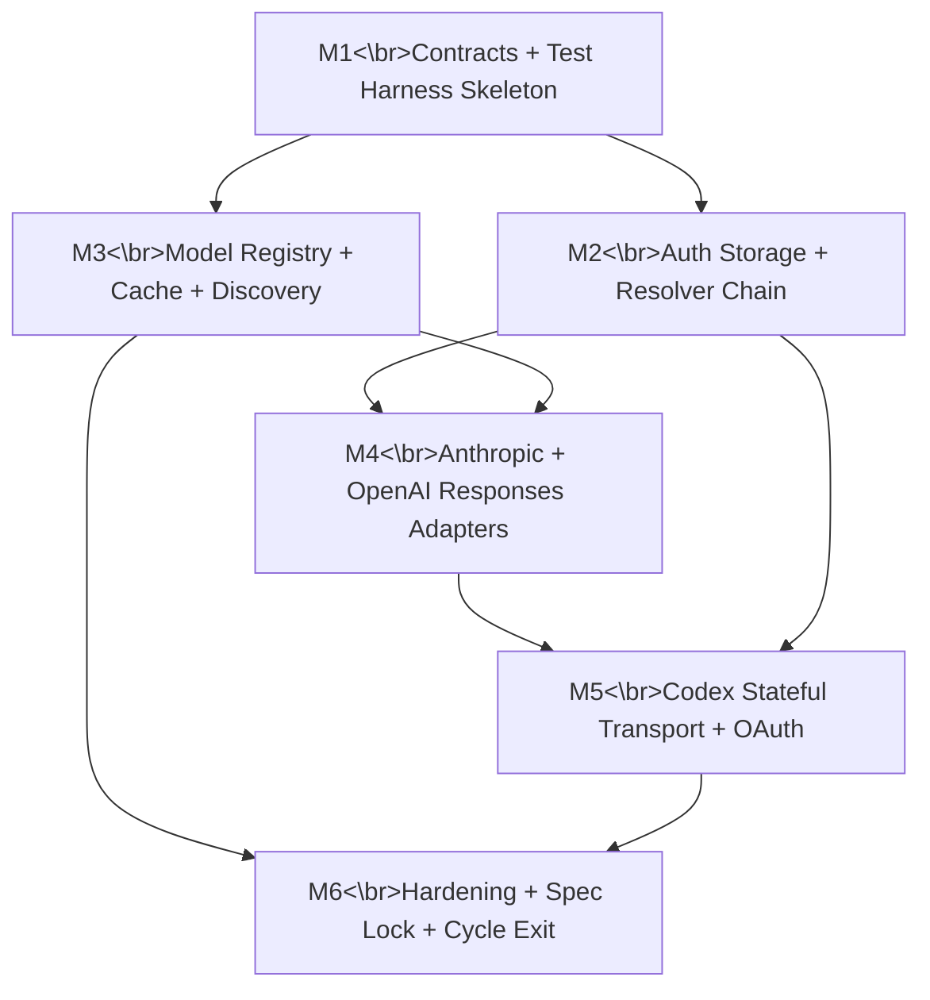

# 11 — Rust-Only Milestone Plan (Cycle 1: AI Connectors First)

## Planning inputs confirmed

- Implementation language: **Rust only**
- Build approach: **from scratch** (no TypeScript runtime reuse/bridge)
- Cadence: **2-week milestones** with hard exit gates
- Cycle 1 provider scope: **Anthropic**, **OpenAI Responses**, **OpenAI Codex Responses**
- Auth scope: **full chain parity** (runtime override -> stored API key -> OAuth refresh -> env -> fallback resolver)
- OAuth scope in Cycle 1: **OpenAI Codex OAuth only** (framework extensible for others)
- Verification depth per milestone:
  - contract tests
  - golden transcript/spec parity
  - deterministic fixtures
  - targeted live smoke tests
- Golden reference source: **Rust-only fixtures/spec snapshots** (no executing TS runtime)
- Parity policy: **parity as reference, controlled cleanup allowed** (must be explicitly approved per milestone)
- Cycle 1 surface: **backend crates + test harness only** (no CLI/login UX wiring yet)

---

## Cycle 1 objective

Deliver production-grade Rust AI connector subsystem with strong abstractions and exhaustive tests, ready to be integrated into runtime in later cycles.

**Out of scope (Cycle 1):** TUI, slash-command UX, MCP manager, edit engine, subagent orchestration, print/RPC mode wiring.

---

## Architectural constraints for Cycle 1

## Crate boundaries (strict)

1. `lorum-ai-contract`
   - canonical event/types contract
   - provider/model/api identifiers
2. `lorum-ai-auth`
   - credential store + resolver chain + OAuth framework
3. `lorum-ai-models`
   - provider descriptors + discovery + merge + cache
4. `lorum-ai-connectors`
   - provider adapters + streaming normalization + stateful transport store
5. `lorum-ai-testkit`
   - fixtures, transcript runner, deterministic stream assertions, live smoke harness

## Cross-crate rules

- No crate may bypass `lorum-ai-contract` event model.
- `lorum-ai-connectors` cannot directly own persistence concerns; persistence goes through `lorum-ai-auth` / `lorum-ai-models` interfaces.
- Provider-specific transport state (Codex WS reuse/fallback) must live behind explicit trait/API, not global mutable singletons.
- All external provider HTTP surfaces must be mockable without network.

---

## Milestone dependency graph (Cycle 1)

---

## Milestone plan (2 weeks each)

## M1 (Weeks 1-2): Canonical AI Contracts + Test Harness Skeleton

**Goal**
Create stable Rust contracts and deterministic test harness foundation for all later connector work.

**Deliverables**

- `lorum-ai-contract`:
  - canonical `AssistantMessageEvent` union (start/delta/end/error)
  - canonical message blocks (`text`, `thinking`, `toolcall`)
  - stop-reason enum and normalized usage struct
- `lorum-ai-testkit`:
  - fixture loader (JSON)
  - event-sequence assertion engine
  - deterministic ordering checker
  - golden snapshot generator (Rust fixture based)

**Abstraction quality gates**

- Provider adapters depend only on contract traits, not concrete enum internals.
- Event sink trait is append-only and side-effect free from provider perspective.
- No provider-specific fields in shared event payloads.

**Tests (minimum)**

- 40+ contract tests:
  - serialization roundtrip
  - enum exhaustiveness checks
  - stop-reason mapping guards
- 20+ deterministic ordering tests:
  - delta merge windows
  - event lifecycle ordering
- 10 schema/compat tests for fixture versions

**Exit gate**

- Contract crate API frozen for M2-M5 (breaking changes require RFC)
- Testkit can replay baseline fixtures with stable hashes across runs

---

## M2 (Weeks 3-4): Auth Storage + Full Resolver Chain + Credential Ranking

**Goal**
Implement full credential lifecycle and resolution precedence in Rust.

**Deliverables**

- `lorum-ai-auth`:
  - sqlite credential store (`auth_credentials`, usage cache table)
  - API key + OAuth credential models
  - resolver chain:
    1. runtime override
    2. persisted API key
    3. OAuth token with refresh
    4. env fallback
    5. provider fallback resolver
  - blocked-credential temporary backoff
  - usage-based ranking API

**Abstraction quality gates**

- `CredentialStore` trait independent from sqlite implementation.
- Resolver policies are pure functions where possible (ranking, precedence).
- Refresh strategy isolated per OAuth provider implementation.

**Tests (minimum)**

- 60+ auth tests:
  - precedence permutations
  - revocation handling
  - transient vs definitive failure behavior
  - session-affinity and round-robin behavior
- 20+ sqlite behavior tests:
  - WAL mode, busy timeout, idempotent upsert
  - disabled credential handling
- 15+ ranking tests with deterministic synthetic quota fixtures
- 6 live smoke tests (provider-auth endpoints mocked + one real-key optional smoke path)

**Exit gate**

- Resolver precedence fully deterministic and documented with fixture matrix
- Backoff/unblock/retry semantics proven by tests (no flaky timing assertions)

---

## M3 (Weeks 5-6): Model Registry + Discovery Merge + Cache Semantics

**Goal**
Implement model discovery pipeline and authoritative cache semantics.

**Deliverables**

- `lorum-ai-models`:
  - provider descriptor registry
  - default model mapping by provider
  - merge pipeline:
    - static -> models.dev snapshot -> cache -> dynamic
  - authoritative/non-authoritative cache rules
  - retry cooldown policy for non-authoritative fetch failures
  - validation/drop rules for malformed model entries

**Abstraction quality gates**

- Discovery sources implement one trait (`ModelSource`) with source-specific priority metadata.
- Merge logic is side-effect free and unit-testable.
- Cache IO failures cannot crash discovery pipeline.

**Tests (minimum)**

- 50+ model merge tests:
  - precedence correctness
  - stale flag behavior
  - malformed record drops
- 25+ cache tests:
  - versioning
  - authoritative semantics
  - read/write failure resilience
- 10 provider descriptor contract tests (including default-model invariants)
- 6 live smoke tests for dynamic discovery endpoints (guarded and retry-safe)

**Exit gate**

- Deterministic `available models` snapshots for all scoped providers
- Cache compatibility documented and reproducible with fixture DBs

---

## M4 (Weeks 7-8): Anthropic + OpenAI Responses Adapters

**Goal**
Ship first two production adapters with canonical stream normalization.

**Deliverables**

- `lorum-ai-connectors` adapters:
  - Anthropic stream adapter
  - OpenAI Responses stream adapter
- shared delta coalescer (50ms merge window)
- provider error normalization and retry policy hooks
- tool-call stream parsing + partial JSON argument assembly

**Abstraction quality gates**

- Adapter output path uses only canonical event sink.
- Retry logic isolated into reusable policy module (no duplicated retry loops).
- Tool-call argument parser shared and fuzz-tested.

**Tests (minimum)**

- 80+ adapter contract tests:
  - start/delta/end sequence
  - stop-reason mapping
  - usage accounting updates
  - error/abort paths
- 20+ fuzz/property tests:
  - streaming JSON chunks for tool-call arguments
  - malformed SSE/frame handling
- 12 golden transcript fixture suites (normal + edge + failure)
- targeted live smoke tests per provider (stream + tool-call + abort)

**Exit gate**

- Both adapters pass full contract + golden suites with zero open P0/P1 defects

---

## M5 (Weeks 9-10): OpenAI Codex Stateful Transport + OAuth (OpenAI Codex)

**Goal**
Implement hardest connector path: SSE/WS stateful transport with fallback plus OAuth callback/refresh.

**Deliverables**

- Codex adapter with:
  - WS primary path (session reuse)
  - SSE fallback path
  - retry budget and transport downgrade logic
  - session state store keyed by `(session_id, provider_id)`
- OAuth framework in `lorum-ai-auth`:
  - callback server abstraction (preferred port + fallback)
  - CSRF state validation
  - manual code fallback input hook
  - token refresh flow
- OpenAI Codex OAuth provider implementation

**Abstraction quality gates**

- Transport state store is injectable and deterministic in tests.
- OAuth callback flow independent from terminal UI and CLI specifics.
- Provider OAuth implementation only depends on shared OAuth trait contracts.

**Tests (minimum)**

- 70+ codex transport tests:
  - WS happy path
  - WS degradation to SSE
  - reconnect/retry envelope
  - session reset semantics
- 40+ OAuth tests:
  - callback timeout
  - state mismatch
  - token refresh success/failure classes
  - manual fallback path
- 15+ security tests:
  - CSRF/state misuse rejection
  - callback URL validation
- 8 live smoke tests (OAuth gated in secure env)

**Exit gate**

- Codex adapter and OAuth implementation stable under retry/cancel/fallback stress
- No auth loop or credential corruption bugs in soak tests

---

## M6 (Weeks 11-12): Cycle 1 Hardening + Controlled Cleanup + Spec Lock

**Goal**
Stabilize connectors/auth/models as reusable Rust foundation for later cycles.

**Deliverables**

- `lorum-ai-*` hardening pass
- controlled cleanup pass (only pre-approved deviations)
- cycle-level compatibility/spec pack:
  - event contracts
  - resolver precedence docs
  - model merge precedence docs
  - provider-specific error mapping docs
- release-candidate test report and defect ledger

**Cleanup policy (controlled changes only)**

Any cleanup must satisfy all three:
1. design note documents change + reason
2. no regression in contract/golden/smoke suites
3. explicit sign-off in cycle gate report

**Tests (minimum)**

- Full regression run for all prior milestone suites
- 24h soak scenarios:
  - repeated streaming turns
  - token expiry/refresh cycling
  - cache staleness and invalidation loops
- fault injection suite:
  - transport timeouts
  - malformed payload storms
  - sqlite busy/partial failure simulation

**Exit gate**

- Cycle 1 Go/No-Go checklist fully green
- No open P0/P1 issues
- Rust AI subsystem declared integration-ready for Cycle 2

---

## Test strategy (Cycle 1 unified)

## Test layers

1. **Unit tests**: pure logic (parsers, precedence, ranking, merge)
2. **Contract tests**: event shape/order and error mapping
3. **Golden fixture tests**: transcript snapshots from Rust spec fixtures
4. **Property/fuzz tests**: stream chunking, partial JSON, parser robustness
5. **Integration tests**: sqlite + adapters + auth/model interactions
6. **Live smoke tests**: minimal real-provider checks (gated secrets)
7. **Soak/fault tests**: resilience under long runs and injected failures

## CI gates per PR

- must pass: fmt, clippy (deny warnings), unit, contract
- nightly: golden + integration + fuzz short-run
- pre-milestone-exit: full smoke + soak + fault suite

---

## Definition of done for Cycle 1

- All 6 milestones completed with evidence
- 2-week cadence maintained with hard gate reviews
- Rust-only connector subsystem can run end-to-end for in-scope providers
- Full auth chain and Codex OAuth available in backend crates
- Test inventory exceeds baseline target (breadth + deterministic reproducibility)

---

## Cycle 2+ preview (high level only)

- **Cycle 2**: runtime composition integration (`lorum-runtime`, `lorum-session`, `lorum-agent-core` binding)
- **Cycle 3**: tool runtime + rendering + native bridge
- **Cycle 4**: edit engine + mutation safety
- **Cycle 5**: MCP/extensibility
- **Cycle 6**: task/subagent + frontends

Cycle 2+ should be planned after Cycle 1 hardening report is accepted.
