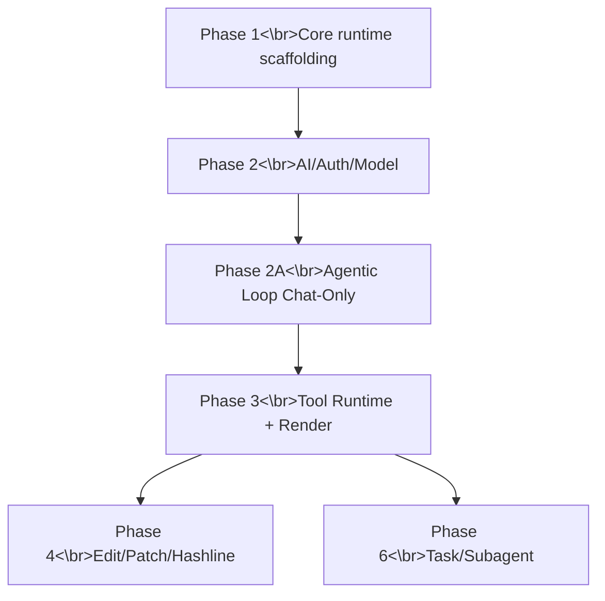

# 15 — Agentic-Loop-First Replan (Before Tool Runtime)

## Goal

Adjust implementation ordering so the runtime ships a proven **agentic chat loop** (user ⇄ assistant, no tools) before implementing tool runtime/rendering.

This document supersedes execution ordering where it conflicts with the earlier ordering in `09_IMPLEMENTATION_ROADMAP.md`.

---

## Architecture evaluation (cross-doc synthesis)

## Evidence from architecture docs

- `01_SYSTEM_OVERVIEW.md` defines core layering where:
  - agent core emits structured events
  - session/runtime consume and persist those events
  - tools are a capability layer above the loop
- `02_AI_CONNECTORS_AND_AUTH.md` shows provider/auth/model integration is already a composable boundary consumed by session/runtime.
- `03_TOOL_SYSTEM_AND_RENDERING.md` describes tool execution/rendering as a separate pipeline with scheduler semantics and fallback rendering.
- `06_SUBAGENTS_TASKS_AND_ORCHESTRATION.md` shows task/subagent behavior explicitly depends on tool runtime (`task` tool, submit enforcement, renderer extraction).
- `07_TUI_AND_INTERACTION_LAYER.md` shows UI consumes event streams and can operate in print/RPC paths independent of tool-heavy interactions.
- `08_RUST_TARGET_ARCHITECTURE.md` separates:
  - `lorum-agent-core` / `lorum-session` / `lorum-runtime` (loop + orchestration)
  - `lorum-tool-*` (tool runtime/render)

## Dependency conclusion

Tool runtime is **not a prerequisite** to proving base agentic turn semantics.

The safer order is:

1. AI/auth/models parity
2. agentic loop parity (chat-only)
3. tool runtime/render
4. edit + task/subagent + UI tool behaviors that depend on tools

This reduces coupling risk and isolates early parity failures to the smallest execution surface.

---

## Revised execution order

## New mandatory sequence

## Why this ordering is better

- Proves turn lifecycle, cancellation, session replay, and mode contracts without tool complexity.
- Prevents tool/runtime bugs from masking base conversation-loop regressions.
- Gives UI/print/RPC teams stable chat-only event contracts earlier.
- Enables cleaner parity diffs: loop drift vs tool drift are separated.

---

## Phase 2A definition (new)

## Scope

Implement and verify chat-only agentic runtime behavior across modes:

- User message intake
- Assistant stream lifecycle (start/delta/end/done/error)
- Turn completion semantics
- Session append/restore/switch for pure chat turns
- Print/RPC contracts for chat-only runs

No tool execution path in this phase.

## Required crates/subsystems

- `lorum-agent-core` (turn orchestration)
- `lorum-session` (conversation persistence/replay)
- `lorum-runtime` (composition root and model provider wiring)
- `lorum-ui-print` / `lorum-ui-rpc` / interactive event handling in chat-only mode

## Out of scope

- Tool scheduling and execution
- Tool renderer precedence/fallback
- Deferred actions / resolve
- Task/subagent orchestration
- Edit engine integration

---

## Phase 2A milestones and gates

## M2A.1 — Chat turn engine parity

- Implement deterministic turn ordering and stop-reason handling for chat-only sessions.
- Gate: golden transcript parity for multi-turn chat (normal, abort, error).

## M2A.2 — Session replay parity (chat-only)

- Ensure append/restore/switch reproduces identical assistant-visible state.
- Gate: replay tests pass with no event-order drift.

## M2A.3 — Mode contract parity (chat-only)

- Validate print text/json and RPC ready/event envelopes for chat-only runs.
- Gate: mode contract tests green (including non-zero exits for error/aborted paths).

## M2A.4 — Integration readiness handoff to tools

- Produce loop-level parity report and frozen event contract snapshot for tool/runtime team.
- Gate: explicit sign-off that Phase 3 may start.

---

## Acceptance criteria for Phase 2A completion

All must be true:

- Chat-only transcript parity is green across representative scenarios.
- Session replay/switch parity is green for chat-only corpus.
- Print and RPC chat-only contracts are green.
- No open P0/P1 loop-level parity defects.
- Tool runtime work remains disabled/blocked until this gate passes.

---

## Impact on downstream phases

- Phase 3 starts later but with cleaner inputs and lower ambiguity.
- Phase 7 (UI) can begin early reducer/event integration in chat-only mode before full tool UX parity.
- Phase 8 integration burden is reduced because loop/tool defects are pre-separated.

---

## Current status alignment

Given current repository progress:

- Cycle 1 AI/auth/models/connectors foundations are implemented and tested.
- This is sufficient to begin Phase 2A immediately.
- Tool runtime implementation should remain blocked until Phase 2A gates pass.
