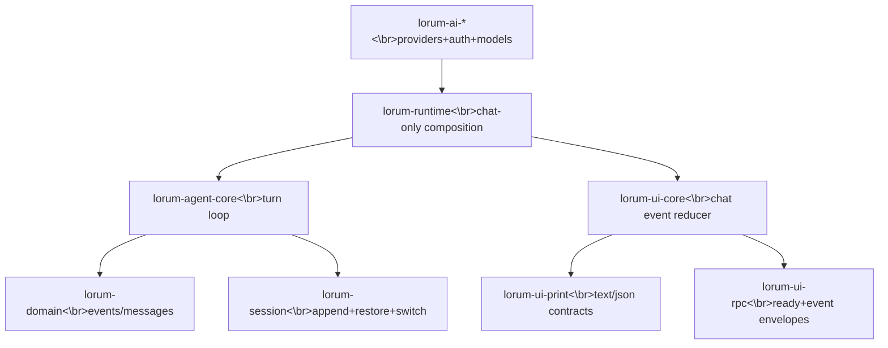

# 16 — Phase 2A Execution Plan (Agentic Loop First, Chat-Only)

## Goal

Execute Phase 2A as a strict gate before Phase 2B/Phase 3, delivering a parity-verified **agentic chat loop** (user ⇄ assistant turns) with tools disabled.

This plan operationalizes:

- `09_IMPLEMENTATION_ROADMAP.md` (Phase 2A insertion)
- `15_AGENTIC_LOOP_FIRST_REPLAN.md` (rationale and gates)
- `19_CORE_UI_FIRST_REPLAN.md` (Phase 2B inserted before Phase 3)

---

## Current state assessment

## What is already available

- AI/auth/models/connectors foundations implemented and tested in `lorum-ai-*` crates.
- Cycle 1 hardening/spec-lock/RC artifacts exist (`12`, `13`, `14`).

## Phase 2A preflight status (M2A.0)

Phase 2A preflight bootstrap is now implemented in this repository.

Added crates:
- `lorum-domain`
- `lorum-session`
- `lorum-agent-core`
- `lorum-ui-core`
- `lorum-ui-print`
- `lorum-ui-rpc`
- `lorum-runtime`

The workspace is wired and all mandatory gates are currently green (`fmt`, `clippy -D warnings`, `cargo test --workspace`).

---

## Scope and non-goals

## In scope (Phase 2A)

- Chat-only turn loop and event sequencing.
- Assistant streaming lifecycle (start/delta/end/done/error) through runtime/session.
- Session append/restore/switch for chat-only turns.
- Chat-only mode contracts for interactive/print/RPC paths.
- Deterministic parity fixtures and gate reports.

## Out of scope (deferred to Phase 3+)

- Tool execution, scheduler semantics, tool render precedence.
- Deferred actions (`resolve` apply/discard).
- Task/subagent orchestration and submit enforcement.
- Edit/patch/hashline runtime integration.

---

## Architecture slice for Phase 2A



Design rule for Phase 2A:

- Runtime must support an explicit `tools_disabled=true` execution path.
- Any tool-call content emitted by models is treated as data only, never executed.


Interface contract authority for implementation details:
- `17_MODULE_INTERFACE_CONTRACTS_AND_DETAILED_ARCHITECTURE.md`

All Phase 2A crate work must satisfy the trait seams, ownership rules, ordering guarantees, and failure semantics defined in doc 17.
---

## Milestone plan

## M2A.0 (Preflight, Week 0-1): Runtime bootstrap for chat-only

**Goal**
Create minimal crate skeletons and contracts required to run chat turns end-to-end.

**Deliverables**

- Workspace members added:
  - `crates/lorum-domain`
  - `crates/lorum-agent-core`
  - `crates/lorum-session`
  - `crates/lorum-runtime`
  - `crates/lorum-ui-core`
  - `crates/lorum-ui-print`
  - `crates/lorum-ui-rpc`
- Shared chat event/message contracts in `lorum-domain`.
- Runtime trait seams compiled with no tool-runtime dependency.

**Exit gate**

- New crates compile and integrate into workspace.
- No direct dependency on tool runtime crates.

---

## M2A.1 (Week 1-2): Chat turn engine parity

**Goal**
Implement deterministic user→assistant turn processing with cancellation/abort semantics.

**Deliverables**

- `lorum-agent-core` chat-only turn executor:
  - stable sequence numbering per turn
  - terminal event semantics (`done` vs `error`/`aborted`)
- `lorum-runtime` composition path using `lorum-ai-connectors` for streamed completion.
- `tools_disabled` guard verified in runtime config.

**Tests (minimum)**

- multi-turn normal chat transcript parity
- aborted turn parity
- provider error propagation parity
- model-switch between turns parity

**Exit gate**

- Golden transcript suite for chat-only turns is fully green.

---

## M2A.2 (Week 2-3): Session replay/switch parity

**Goal**
Ensure chat state durability and deterministic replay independent of tool events.

**Deliverables**

- `lorum-session` append-only chat event log format.
- restore/switch behavior matching chat-only baseline.
- compaction-safe replay for chat-only corpus.

**Tests (minimum)**

- restore after N turns preserves assistant-visible state
- switch between sessions preserves per-session model/thinking context
- replay order stability under restart and compaction

**Exit gate**

- Session replay compatibility report produced with zero ordering drift.

---

## M2A.3 (Week 3-4): Mode contract parity (chat-only)

**Goal**
Prove mode-level contracts before tools are introduced.

**Deliverables**

- `lorum-ui-print`:
  - text mode output behavior for chat-only turns
  - JSON mode envelope/event stream behavior
- `lorum-ui-rpc`:
  - ready sentinel and event envelope contract for chat-only mode
- interactive adapter consumes same runtime events in tools-disabled path.

**Tests (minimum)**

- print text mode exit-code behavior on `error` and `aborted`
- print JSON header/event stream parity
- RPC `ready` + event stream envelope parity

**Exit gate**

- Mode contract parity report for chat-only path is fully green.

---

## M2A.4 (Week 4): Tool-runtime handoff gate

**Goal**
Freeze chat-loop contracts consumed by Phase 3 team.

**Deliverables**

- Agentic loop parity report (chat-only)
- Session replay compatibility report
- Mode contract compatibility report
- contract freeze note for Phase 3 consumers

**Exit gate**

- No open P0/P1 defects in chat-only runtime path.
- Formal sign-off: Phase 3 tool runtime is unblocked.

---

## Verification matrix and commands

Mandatory gates for every M2A milestone:

```bash
cargo fmt --all -- --check
cargo clippy --workspace --all-targets -- -D warnings
cargo test --workspace
```

Additional M2A-specific suites to add and run:

- `cargo test -p lorum-agent-core --test chat_turn_parity`
- `cargo test -p lorum-session --test chat_replay_restore`
- `cargo test -p lorum-ui-print --test chat_only_print_contract`
- `cargo test -p lorum-ui-rpc --test chat_only_rpc_contract`

Golden artifact requirements:

- chat-only transcript corpus (normal/abort/error/model-switch)
- deterministic replay snapshots for session restore/switch
- mode contract snapshots for print/json/rpc

---

## Risks and controls

1. **Hidden tool coupling in runtime/session paths**
   - Control: compile-time feature gate + runtime assertion for tools-disabled mode.

2. **Event-order drift between core/session/UI consumers**
   - Control: sequence-order contract tests and reducer snapshot checks.

3. **Mode contract regressions masked by interactive-only tests**
   - Control: dedicated print/RPC parity suites as hard gates.

---

## Definition of done for Phase 2A

Phase 2A is done only when all are true:

- Chat-only turn loop parity is green.
- Session replay/switch parity is green.
- Print/RPC chat-only contract parity is green.
- No open P0/P1 parity blockers.
- Phase 3 receives signed handoff artifacts.

---

## Immediate execution sequence

1. Implement M2A.0 workspace/bootstrap crates following interface contracts in doc 17.
2. Wire chat-only runtime path in `lorum-runtime` to `lorum-ai-*` through the documented trait seams.
3. Add transcript/replay/mode contract suites using doc 17 ordering/failure rules as assertions.
4. Run full gates and publish M2A reports.
5. Only then begin Phase 2B core/UI hardening and sign-off work (doc 19); start Phase 3 only after 2B gates are green.
