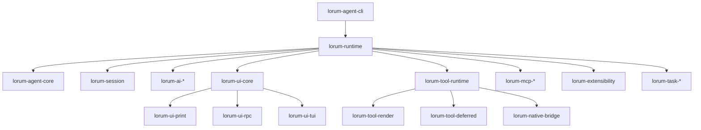
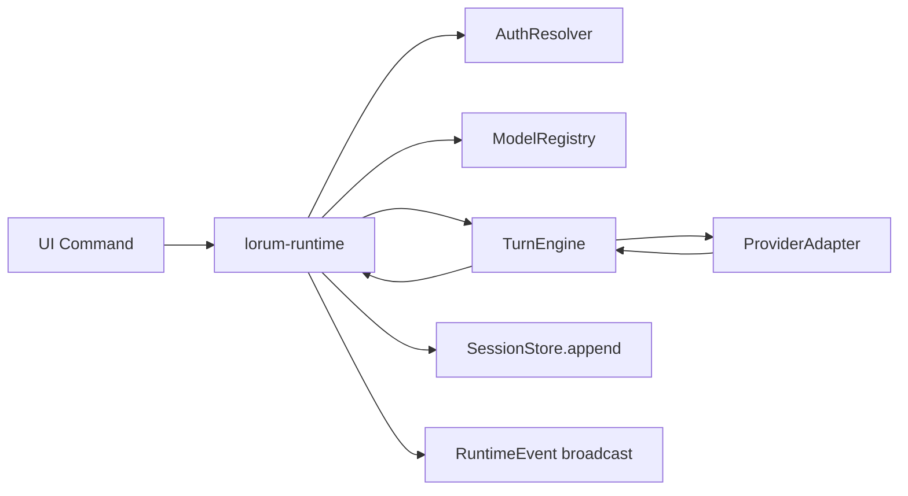

# 17 — Module Interface Contracts and Detailed Runtime Architecture

## Goal

Define explicit, enforceable interfaces between runtime modules so implementation can proceed in parallel without hidden coupling.

This document is the source of truth for:

- module boundaries
- inter-module APIs
- event/data ownership
- sequencing and failure semantics

It is aligned with the revised ordering in Phase 2A (chat-only first).

---

## 1) Layered architecture (authoritative)



Layer rules:

1. `lorum-runtime` is composition-only. It wires interfaces; it must not contain provider or tool business logic.
2. `lorum-agent-core` owns turn orchestration semantics.
3. `lorum-session` owns persistence and replay semantics.
4. `lorum-ui-*` consume runtime events; they do not mutate core/session state directly.
5. During Phase 2A, `lorum-tool-*`, `lorum-task-*` interfaces exist but are disabled at runtime path.

---

## 2) Crate responsibilities and mandatory interfaces

## 2.1 `lorum-domain`

**Responsibility**
Canonical IDs, events, message blocks, and envelope types consumed by all layers.

**Exports (required)**

- `RuntimeEvent`
- `TurnId`, `SessionId`, `MessageId`
- `AssistantMessage`, `AssistantMessageEvent`
- `UiCommand`, `UiNotification`

**Must not depend on**

- providers, tools, UI, storage drivers.

---

## 2.2 `lorum-agent-core`

**Responsibility**
Turn state machine and event sequencing for chat/tool turns.

**Phase 2A required interface**

```rust
#[async_trait]
pub trait TurnEngine: Send + Sync {
    async fn run_turn(
        &self,
        req: TurnRequest,
        sink: &mut dyn RuntimeEventSink,
    ) -> Result<TurnResult, TurnError>;
}
```

**Semantics**

- Emits deterministic sequence numbers within a turn.
- Emits one terminal turn outcome (`done` | `error` | `aborted`).
- Honors cancellation token hierarchy from runtime.

---

## 2.3 `lorum-session`

**Responsibility**
Append-only persistence, restore/switch, replay ordering.

**Required interfaces**

```rust
pub trait SessionStore: Send + Sync {
    fn append(&self, session_id: &SessionId, ev: &RuntimeEvent) -> Result<(), SessionError>;
    fn replay(&self, session_id: &SessionId) -> Result<Vec<RuntimeEvent>, SessionError>;
    fn switch(&self, from: &SessionId, to: &SessionId) -> Result<SwitchResult, SessionError>;
}
```

**Semantics**

- Replay order must be byte-for-byte deterministic for the same persisted log.
- Switch must be atomic at runtime boundary (no mixed-session state after success).

---

## 2.4 `lorum-runtime`

**Responsibility**
Composition root and policy gatekeeper.

**Required interfaces**

```rust
pub trait RuntimeController: Send + Sync {
    async fn submit_user_input(&self, cmd: UserInputCommand) -> Result<(), RuntimeError>;
    async fn set_model(&self, req: ModelSelectRequest) -> Result<(), RuntimeError>;
    async fn subscribe(&self, sink: Arc<dyn RuntimeEventSink>) -> Result<SubscriptionId, RuntimeError>;
}
```

**Semantics**

- Enforces runtime mode (`tools_disabled`) and phase gates.
- Resolves model + auth before turn start.
- Bridges turn engine output into session append + UI event broadcast.

---

## 2.5 `lorum-ai-*` boundary (already implemented)

**Responsibility**
Provider-agnostic assistant stream contract, auth, model selection, connectors.

**Consumed interfaces**

- `ProviderAdapter`
- `AssistantEventSink`
- `AuthResolver` + credential store semantics
- model registry/cache APIs

**Runtime contract to core**

- Converts provider stream to canonical assistant events.
- No UI assumptions.

---

## 2.6 `lorum-ui-core` and mode crates

**Responsibility**
Reducer and rendering contracts across interactive/print/RPC.

**Required interfaces**

```rust
pub trait UiReducer: Send + Sync {
    fn apply(&mut self, ev: &RuntimeEvent);
}

#[async_trait]
pub trait UiCommandSink: Send + Sync {
    async fn send(&self, cmd: UiCommand) -> Result<(), UiError>;
}
```

**Semantics**

- UI is event-driven only.
- Print/RPC must preserve envelope and exit-code contracts.

---

## 2.7 Deferred modules (Phase 3+)

- `lorum-tool-runtime`, `lorum-tool-render`, `lorum-tool-deferred`
- `lorum-task-*`
- `lorum-mcp-*`
- `lorum-extensibility`

They must integrate through `lorum-runtime` interfaces only; no direct back-channel into `lorum-agent-core` internals.

---

## 3) Phase 2A runtime interaction contract (chat-only)



Phase 2A guardrails:

1. `tools_disabled = true` required in runtime config.
2. Tool-call events from model output are never executed.
3. Session logs only chat-loop events; no tool lifecycle events in Phase 2A corpus.

---

## 4) Data ownership contract

| Data | Owner | Writers | Readers |
|---|---|---|---|
| Runtime event stream | `lorum-agent-core` + `lorum-runtime` | core/runtime | session, ui, rpc, print |
| Session event log | `lorum-session` | runtime only | runtime restore, ui rebuild |
| Auth credentials | `lorum-ai-auth` | auth store/resolver | runtime/auth boundary |
| Model availability cache | `lorum-ai-models` | model manager | runtime model selection |
| Tool pending actions | `lorum-tool-deferred` | tool runtime | resolve tool/ui |

Rule: if two modules write the same data domain, boundary is invalid and must be redesigned.

---

## 5) Event contract and ordering rules

1. Sequence numbers are monotonic per turn.
2. Terminal event is emitted once per turn.
3. Session append order equals emitted order.
4. UI reducer applies events in source order only.
5. Replay preserves original order and terminal semantics.

Any violation is P1 parity blocker.

---

## 6) Failure and cancellation contract

## 6.1 Failure mapping

- provider/auth/model errors normalize to runtime-level error envelopes.
- runtime emits explicit terminal error event and persists it.

## 6.2 Cancellation

- parent cancel token cancels active turn.
- cancelled turn emits `aborted` terminal reason.
- no partial post-terminal emission allowed.

## 6.3 Backpressure and fanout

- event broadcast must not reorder events.
- slow UI subscriber cannot mutate core ordering semantics; buffer policy must be explicit.

---

## 7) Interface stability policy

- Traits in this document are phase contracts.
- Signature change requires compatibility note and gate sign-off.
- Parser/literal-sensitive fields remain frozen during parity phases.

---

## 8) Implementation checklist (for upcoming execution)

## Phase 2A checklist

- [x] Define `lorum-domain` event/message IDs and envelopes.
- [x] Implement `TurnEngine` chat-only path in `lorum-agent-core`.
- [x] Implement `SessionStore` append/replay/switch in `lorum-session`.
- [x] Implement `RuntimeController` with `tools_disabled` enforcement.
- [x] Implement chat-only reducer path in `lorum-ui-core`.
- [x] Validate print/RPC chat-only envelopes and exit contracts.

## Phase 3 readiness checklist

- [ ] Phase 2A reports complete (chat parity, replay parity, mode parity).
- [ ] No open P0/P1 in chat-only loop.
- [ ] Tool runtime receives frozen event/interface contracts.

---

## 9) Decision log

1. Agentic loop correctness is treated as foundational contract separate from tool runtime complexity.
2. Runtime composition remains the only orchestration point between AI/session/UI/tool stacks.
3. Data ownership is single-writer per domain to avoid hidden state drift.
