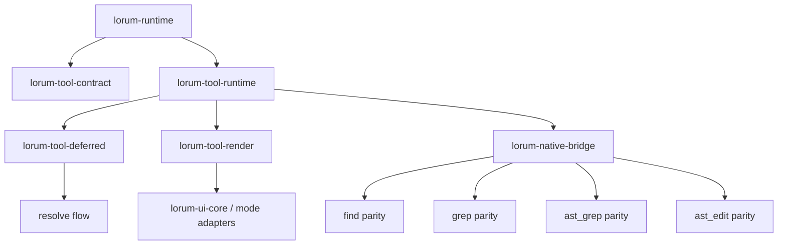

# 18 — Phase 3 Execution Plan (Tool Runtime, Rendering, Native Bridge)

## Goal

Execute Phase 3 as the next implementation wave after Phase 2 AI foundations, with explicit interface boundaries and parity gates for:

- tool execution/runtime semantics
- renderer precedence/fallback behavior
- deferred action (`resolve`) lifecycle
- native bridge parity (`find`/`grep`/`ast_*`)

This plan assumes the current Rust workspace state where Phase 2 is complete, Phase 2A bootstrap is implemented, and Phase 2B hardening is the immediate predecessor gate (`19_CORE_UI_FIRST_REPLAN.md`).

---

## Phase readiness decision

## Phase 2 status

Phase 2 (AI/auth/models/connectors) is complete and gate-verified.

Evidence:

- `14_CYCLE1_RC_TEST_REPORT_AND_DEFECT_LEDGER.md`
- Current workspace gates pass (`fmt`, `clippy -D warnings`, `cargo test --workspace`).

## Phase 2A status

Implemented:

- M2A.0 bootstrap crates exist (`lorum-domain`, `lorum-agent-core`, `lorum-session`, `lorum-runtime`, `lorum-ui-*`).
- parity integration tests exist for chat turn/replay baselines.

Still missing for formal 2A sign-off:

- frozen parity report artifacts (chat parity/replay/mode reports) as release docs.
- explicit Phase 2A sign-off record in index/gate bundle.

## Phase 2B status

- Not started yet.
- Defined in `19_CORE_UI_FIRST_REPLAN.md` as mandatory hardening/sign-off gate before Phase 3 implementation.
- Detailed implementation tasks are defined in `20_PHASE2B_AGENT_UI_IMPLEMENTATION_BLUEPRINT.md`.
## Phase 3 start policy for this repo

Phase 3 is intentionally postponed until Phase 2B is complete.

- Planning/design for Phase 3 may continue.
- Phase 3 implementation start requires Phase 2B exit gates and sign-off artifacts to be green.

---

## Scope

## In scope

- `lorum-tool-contract`
- `lorum-tool-runtime`
- `lorum-tool-render`
- `lorum-tool-deferred`
- `lorum-native-bridge`

## Out of scope

- edit/patch/hashline migration internals (Phase 4)
- MCP/capability/extensibility migration internals (Phase 5)
- task/subagent full orchestration migration internals (Phase 6)

---

## Interface contract baseline (must hold)

Phase 3 modules must implement and consume seams defined in docs `08` and `17`, especially:

- `ToolExecutor`
- `ToolUpdateSink`
- `ToolRenderer`
- `PendingAction`
- `PendingActionStore`

Constraints:

1. `lorum-runtime` remains composition-only; tool business logic belongs in `lorum-tool-runtime`.
2. Runtime event ordering invariants from Phase 2A remain unchanged.
3. Tool renderer failures must degrade safely to fallback output.
4. Native bridge behavior must match TS-visible behavior for limits, offsets, ordering, and error surfaces.

---

## Architecture slice for Phase 3



---

## Milestone plan

## M3.0 (Preflight): Tool contract and fixture baseline

**Goal**
Establish immutable contract surfaces and golden fixtures before executor implementation.

**Deliverables**

- `lorum-tool-contract` crate with:
  - tool descriptor schema and flags (`hidden`, `deferrable`, `non_abortable`, `concurrency`, `lenient_arg_validation`)
  - lifecycle event envelope definitions
  - argument validation result model
- Golden fixtures:
  - lifecycle event sequences for normal/error/aborted/skipped tool paths
  - tool-set auto-enrichment scenarios

**Exit gate**

- contract serialization and fixture compatibility tests green.

---

## M3.1: Execution scheduler and lifecycle parity

**Goal**
Implement shared/exclusive scheduling and lifecycle event semantics.

**Deliverables**

- `lorum-tool-runtime` scheduler with deterministic ordering by call index.
- lifecycle emission:
  - `tool_execution_start`
  - `tool_execution_update`
  - `tool_execution_end`
- lenient argument-validation bypass behavior parity.
- explicit aborted/skipped synthetic tool result generation.

**Tests (minimum)**

- shared/exclusive mixed batch ordering
- abort during shared batch + exclusive barrier behavior
- lenient/non-lenient arg validation matrix
- lifecycle ordering invariants

**Exit gate**

- scheduler parity suite green with deterministic replay checks.

---

## M3.2: Deferred action and resolve semantics

**Goal**
Implement proposal→resolve split for deferrable tools.

**Deliverables**

- `lorum-tool-deferred` pending-action store (push/pop/peek + subscriptions).
- `resolve` behavior with required `action` and `reason` semantics.
- source tool metadata propagation for renderer.

**Tests (minimum)**

- apply/discard flow correctness
- pending stack semantics with multiple actions
- reject path handling when `reject` is absent
- error path when no pending action exists

**Exit gate**

- deferred/resolve parity suite green.

---

## M3.3: Renderer precedence and failure isolation

**Goal**
Port rendering dispatch with strict precedence and safe fallback.

**Deliverables**

- `lorum-tool-render` registry and dispatch:
  1. tool custom renderer
  2. registry renderer
  3. generic fallback
- panic/error isolation in rendering path.
- normalized error rendering and meta-notice wrapper compatibility.

**Tests (minimum)**

- precedence selection matrix
- injected renderer panic falls back safely
- inline/merge call-result behavior parity

**Exit gate**

- renderer resilience and output parity suites green.

---

## M3.4: Native bridge parity for find/grep/ast

**Goal**
Reproduce native behavior contracts currently relied on by runtime/tools.

**Deliverables**

- `lorum-native-bridge` adapters for:
  - `find`
  - `grep`
  - `ast_grep`
  - `ast_edit`
- deterministic limit/offset handling and ordering semantics.
- parse issue/error normalization compatibility.

**Tests (minimum)**

- fixture corpus for offsets/limits/sorting
- mixed-success/error behavior
- AST parse issue propagation and rewrite summaries

**Exit gate**

- native bridge compatibility report green vs fixture corpus.

---

## M3.5: Runtime integration and freeze

**Goal**
Integrate all Phase 3 crates into `lorum-runtime` with stable seams for Phase 4+.

**Deliverables**

- runtime wiring to tool runtime/render/deferred/native modules.
- policy-expansion hooks (`ast_*`, `resolve`, `submit_result`, `exit_plan_mode`) available at integration seam.
- Phase 3 parity report bundle and defect ledger.

**Exit gate**

- tool lifecycle parity validated including deferred and renderer fallback behavior.

---

## Work breakdown by crate

## `lorum-tool-contract`

- Tool descriptors + flags
- lifecycle event structs
- validation/error models

## `lorum-tool-runtime`

- scheduler
- executor abstraction
- update sink handling
- synthetic skipped/aborted result logic

## `lorum-tool-deferred`

- pending action trait/store
- resolve transaction semantics

## `lorum-tool-render`

- renderer registry
- precedence dispatcher
- fallback safety path

## `lorum-native-bridge`

- bridge adapters and response envelopes
- fixture-backed behavior tests

---

## Verification matrix

Mandatory gates:

```bash
cargo fmt --all -- --check
cargo clippy --workspace --all-targets -- -D warnings
cargo test --workspace
```

Phase 3 suites to add:

- `cargo test -p lorum-tool-runtime --test scheduler_parity`
- `cargo test -p lorum-tool-runtime --test lifecycle_sequence_parity`
- `cargo test -p lorum-tool-deferred --test resolve_flow_parity`
- `cargo test -p lorum-tool-render --test renderer_precedence_and_fallback`
- `cargo test -p lorum-native-bridge --test native_behavior_fixtures`

---

## Risks and controls (Phase 3 specific)

1. **Scheduler nondeterminism**
   - Control: deterministic ordering by input index + explicit barrier tests.

2. **Renderer trust regression**
   - Control: panic-injection tests and mandatory fallback snapshots.

3. **Native semantic drift**
   - Control: fixture corpus mirrors TS behavior including parse/error edge cases.

4. **Policy-expansion drift for hidden/companion tools**
   - Control: explicit enrichment matrix tests at runtime integration boundary.

---

## Immediate next actions

1. Create `lorum-tool-contract` and freeze event/descriptor contracts (M3.0).
2. Implement scheduler core in `lorum-tool-runtime` with deterministic lifecycle emission (M3.1).
3. Implement `lorum-tool-deferred` + resolve semantics (M3.2).
4. Integrate renderer precedence and fallback logic (M3.3).
5. Implement native bridge parity adapters (M3.4).
6. Publish Phase 3 parity report bundle and gate summary (M3.5).

---

## Definition of done for Phase 3

Phase 3 is done only when:

- tool scheduler/lifecycle parity suites are green,
- deferred/resolve semantics are parity-verified,
- renderer precedence/fallback behavior is parity-verified,
- native bridge fixture compatibility is green,
- no open P0/P1 blockers remain,
- Phase 3 parity report bundle is published for Phase 4 handoff.
