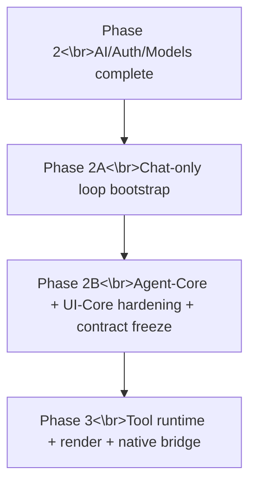

# 19 — Core/UI First Replan (Phase 2B Hardening Before Phase 3)

## 1) Problem statement: why Phase 3 is postponed

Phase 3 (tool runtime/render/native bridge) is postponed to introduce a **mandatory Phase 2B hardening gate** focused on `lorum-agent-core` and `lorum-ui-core` stability.

Reason: docs `09`, `16`, `17`, and `18` already establish that:
- chat-loop ordering/cancellation semantics are foundational contracts (`09`, `17`),
- UI consumes runtime events and must remain event-order consistent (`17`),
- formal 2A sign-off artifacts are still incomplete (`18`),
- Phase 3 should only proceed after foundational loop contracts are frozen (`09`, `16`, `17`).

Starting full Phase 3 implementation before hardening these foundations raises the probability of rework in scheduler semantics, renderer assumptions, and deferred-action integration.

## 2) Dependency analysis: why core/ui hardening must precede tool runtime

### 2.1 Contract dependency chain

1. `lorum-agent-core` defines turn terminal semantics (`done | error | aborted`) and sequence monotonicity.
2. `lorum-runtime` forwards those events to session and UI without reordering.
3. `lorum-ui-core` reducer correctness depends on strict event ordering and terminal uniqueness.
4. Phase 3 tool lifecycle events extend the same event stream and rely on the same ordering/failure contracts.

If (1)-(3) are not hardened/frozen, Phase 3 introduces additional event classes on top of unstable base semantics.

### 2.2 Specific risk propagation into Phase 3

- **Loop cancellation ambiguity** in `lorum-agent-core` leaks into tool abort/skip semantics.
- **Reducer state drift** in `lorum-ui-core` causes incorrect rendering of tool lifecycle/progress events.
- **Runtime↔UI contract looseness** makes renderer fallback behavior appear nondeterministic even when tool runtime is correct.
- **Missing sign-off artifacts** prevents objective go/no-go decisions for Phase 3 readiness.

### 2.3 Already done vs not yet sign-off complete

Already done (per docs `16`/`18`):
- Phase 2 foundations and 2A bootstrap crates exist.
- Workspace-level gates are green.
- Initial parity tests exist for chat turn/replay baselines.

Not yet complete for formal sign-off:
- Frozen, publishable 2A parity report bundle (chat parity, replay parity, mode parity).
- Explicit gate record that contracts are frozen for downstream Phase 3 consumers.
- Additional hardening evidence on cancellation/state-machine and reducer consistency under adverse sequencing.

## 3) Revised phase ordering

A new **Phase 2B — Core/UI Contract Hardening & Sign-off** is inserted before Phase 3.

Execution rule: no Phase 3 implementation milestone may be marked started until Phase 2B exit gate is green.

## 4) Phase 2B detailed milestone set

## M2B.0 — Baseline lock and gap closure

**Objective**
Create a single authoritative readiness baseline from docs `09`/`16`/`17`/`18` and current test artifacts.

**Milestone outputs**
- Phase 2A completion matrix updated to explicit pass/fail status by contract area.
- Gap list for missing formal sign-off artifacts.
- Frozen baseline snapshot reference for subsequent M2B checks.

**Go/No-Go**
- Go only if all open items are concretely enumerated and mapped to owners/artifacts.

## M2B.1 — `lorum-agent-core` loop/cancellation/state-machine hardening

**Objective**
Harden turn state-machine invariants before tool event expansion.

**Milestone outputs**
- Verified invariant set for: monotonic sequencing, single terminal outcome, cancellation propagation, no post-terminal emissions.
- Deterministic behavior evidence for normal/error/aborted/model-switch turn classes.
- Defect ledger for any ordering/cancellation violations with closure status.

**Go/No-Go**
- No open P0/P1 defects in loop cancellation/state-machine behavior.

## M2B.2 — `lorum-ui-core` reducer/state consistency hardening

**Objective**
Harden reducer consistency under realistic ordering, replay, and terminal-state edges.

**Milestone outputs**
- Reducer invariant set covering idempotence expectations, terminal-state handling, and replay consistency.
- Evidence that reducer outcomes are deterministic for equivalent event streams.
- Resolved defect list for state drift, duplicate-terminal handling, and replay mismatch.

**Go/No-Go**
- No open P0/P1 reducer consistency defects.

## M2B.3 — Runtime↔UI integration contract tightening

**Objective**
Freeze runtime-to-UI event contract details required for Phase 3 tool lifecycle expansion.

**Milestone outputs**
- Finalized contract spec for event ordering, required fields, and terminal guarantees at the runtime/UI boundary.
- Explicit compatibility statement that Phase 3 tool events are additive and do not alter base chat-loop guarantees.
- Change-control rule: any contract changes after freeze require formal compatibility review.

**Go/No-Go**
- Contract freeze ratified and referenced as mandatory dependency for Phase 3.

## M2B.4 — Report/sign-off artifact bundle

**Objective**
Produce auditable evidence package that unambiguously unblocks Phase 3.

**Required artifacts**
- Agent-core hardening report.
- UI-core hardening report.
- Runtime↔UI contract freeze note.
- Consolidated defect ledger with severities and disposition.
- Phase 2A+2B sign-off record with explicit unblock decision.

**Go/No-Go**
- Unblock only when artifact bundle is complete and all P0/P1 items are closed.

## 5) Explicit unblock condition for Phase 3

Phase 3 is unblocked **only if all conditions are true**:
1. M2B.1, M2B.2, M2B.3, and M2B.4 exit gates are green.
2. No open P0/P1 issues in agent-loop semantics, reducer consistency, or runtime↔UI contract compliance.
3. Formal sign-off artifacts are published and indexed as the authoritative gate decision.
4. Phase 3 kickoff references the frozen contract revision from M2B.3.

If any condition fails, Phase 3 remains blocked.

## 6) Immediate execution checklist (start Phase 2B now)
Execution blueprint reference: `20_PHASE2B_AGENT_UI_IMPLEMENTATION_BLUEPRINT.md`

- [ ] Confirm this replan as the controlling sequence update before Phase 3.
- [ ] Establish M2B.0 baseline matrix from existing 2A/Phase 2 evidence.
- [ ] Run M2B.1 hardening sweep on `lorum-agent-core` loop/cancellation/state-machine invariants.
- [ ] Run M2B.2 hardening sweep on `lorum-ui-core` reducer/state consistency invariants.
- [ ] Execute M2B.3 runtime↔UI contract freeze and publish revision identifier.
- [ ] Assemble M2B.4 sign-off artifact bundle and final go/no-go decision.
- [ ] Start Phase 3 only after explicit unblock record is published.

## Planning boundary

This document is a sequencing and gate policy update. It does not claim completion of M2B work; completion is defined only by the listed M2B artifacts and go/no-go gates.